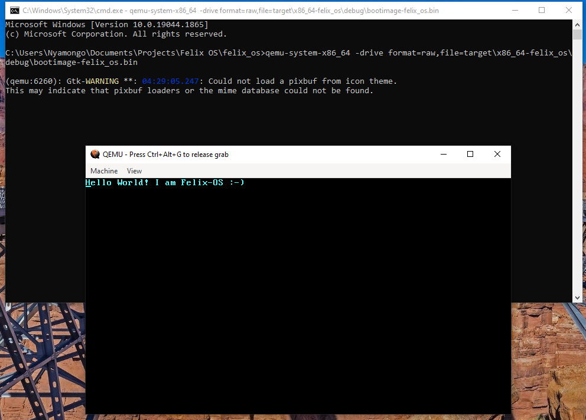

# Felix-O.S
My implementation of the Philipp Oppermann's blog, [Writing an OS in Rust](https://os.phil-opp.com/)

[Uncle Scientist](https://www.youtube.com/playlist?list=PLib6-zlkjfXkdCjQgrZhmfJOWBk_C2FTY)'s playlist was also very helpful.

Felix-OS Running in QUEMU Emulator
